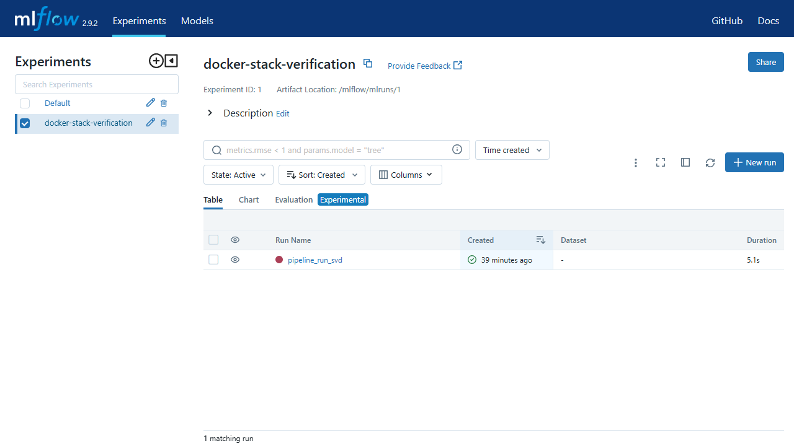
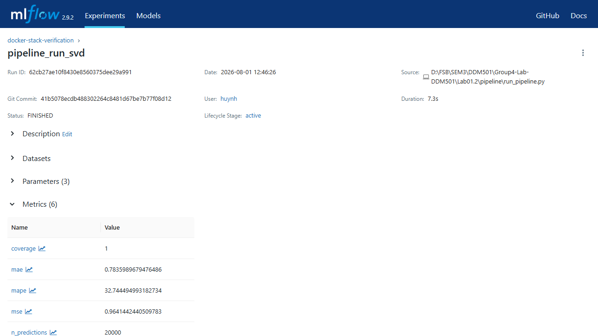
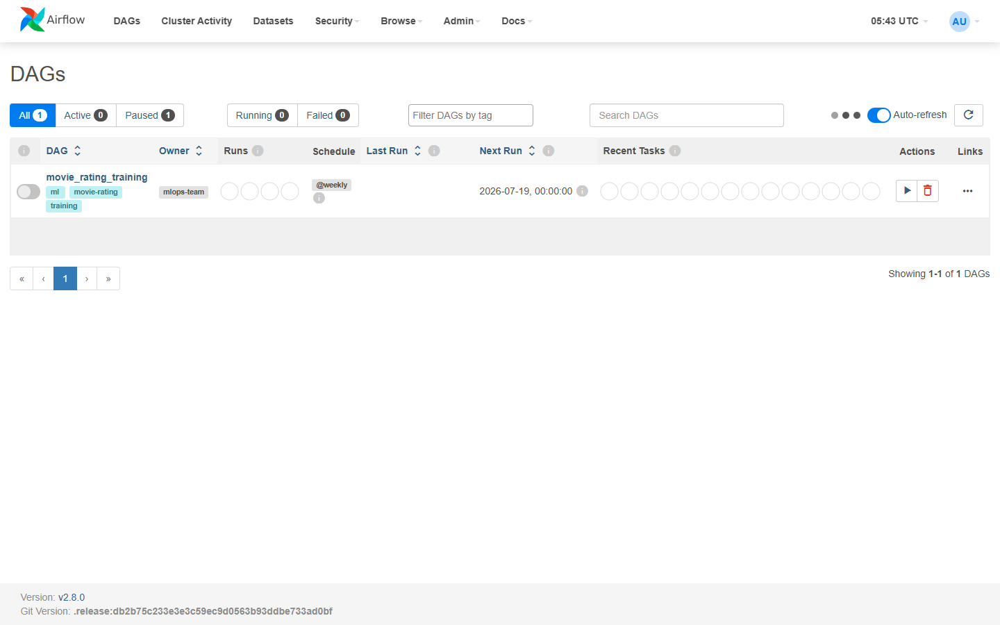
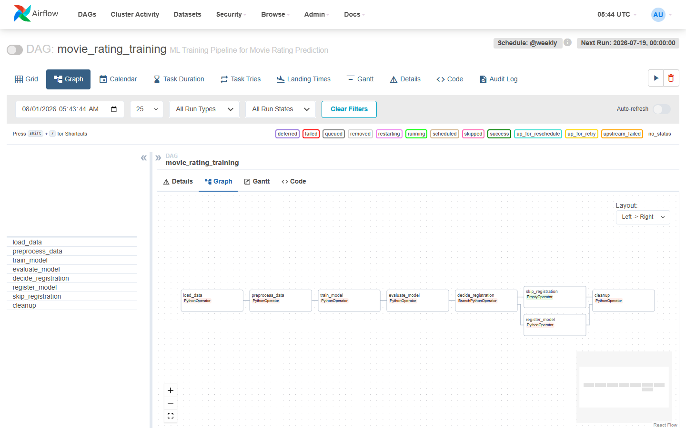

# Experiment Report

Generated: 2026-08-01 11:51:45

## Summary
- Total experiments: 9
- Successful: 9
- Failed: 0

## Results
| Rank | Model | Parameters | RMSE | MAE | Run ID |
| ---: | --- | --- | ---: | ---: | --- |
| 1 | svd | `{"lr_all": 0.005, "n_epochs": 20, "n_factors": 50, "reg_all": 0.02}` | 0.9320 | 0.7356 | 6681ecaed4a64d718e92a0f442c6b392 |
| 2 | svd | `{"lr_all": 0.005, "n_epochs": 20, "n_factors": 100, "reg_all": 0.02}` | 0.9365 | 0.7390 | ad9e1ab96fc84255872901e62b2e0d87 |
| 3 | svd | `{"lr_all": 0.01, "n_epochs": 30, "n_factors": 150, "reg_all": 0.02}` | 0.9557 | 0.7500 | 7e3b805b404e4bacaf703db7efc82164 |
| 4 | svd | `{"lr_all": 0.005, "n_epochs": 50, "n_factors": 100, "reg_all": 0.02}` | 0.9665 | 0.7561 | 164cd85285b842718821df8382afbf4a |
| 5 | knn | `{"k": 40, "sim_options": {"name": "pearson", "user_based": true}}` | 1.0150 | 0.8037 | a0026188b52042cfb08719a31aa07ba0 |
| 6 | knn | `{"k": 40, "sim_options": {"name": "cosine", "user_based": true}}` | 1.0194 | 0.8038 | 8fa9826701e941d2b2c5e54a77cfb189 |
| 7 | knn | `{"k": 20, "sim_options": {"name": "cosine", "user_based": true}}` | 1.0284 | 0.8099 | f7ec961993b144488ecc085b35703335 |
| 8 | nmf | `{"n_epochs": 50, "n_factors": 50}` | 1.0320 | 0.7875 | a2329d9ded504c169089c18d0b325b66 |
| 9 | nmf | `{"n_epochs": 50, "n_factors": 100}` | 1.1024 | 0.8393 | 1e8743c70fa94deca1c31af7ca2ed5cf |

## Best Model
- Configuration: `{"lr_all": 0.005, "model_type": "svd", "n_epochs": 20, "n_factors": 50, "reg_all": 0.02}`
- RMSE: 0.9320
- MAE: 0.7356
- Registry: `movie-rating-model`, version `1`, stage `Production`.
- Recommendation: use this registered version after validating its serving behavior.

## Docker Stack Verification

The submitted Docker stack was verified after startup:

- Airflow is available at `http://localhost:8080`; the verified local account is
  `admin` / `admin`.
- MLflow is available at `http://localhost:5000`.
- A verification SVD run completed successfully with RMSE `0.9819`, MAE
  `0.7836`, 20,000 predictions, and four logged artifact paths (`model`,
  `raw_model`, and two evaluation plots).

### MLflow evidence

### Airflow evidence

