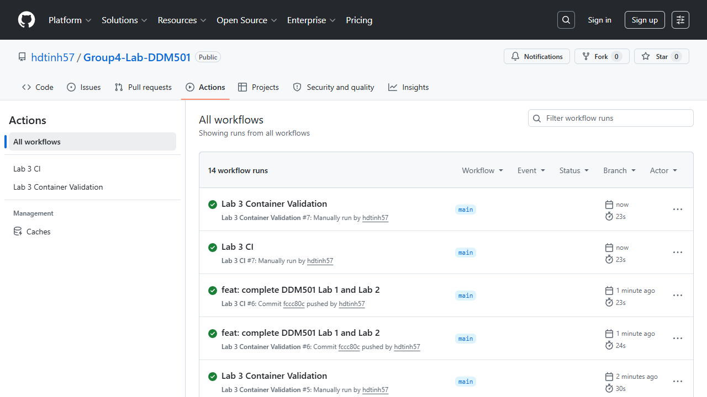

# Lab 3 - Testing & CI/CD

Quality-assured Movie Rating API with unit, integration, data-boundary and model-behaviour tests.

```powershell
pip install -r requirements-dev.txt
pytest tests
uvicorn app.main:app --reload
```

Open `http://localhost:8000/docs`. GitHub Actions executes linting, the 80% coverage gate, Docker image build, and a container health check. See [testing strategy](docs/testing_strategy.md).

## GitHub Actions evidence

Both Lab 3 workflows completed successfully: the CI job verifies linting and
coverage, while Container Validation builds the image and calls `/health`.


