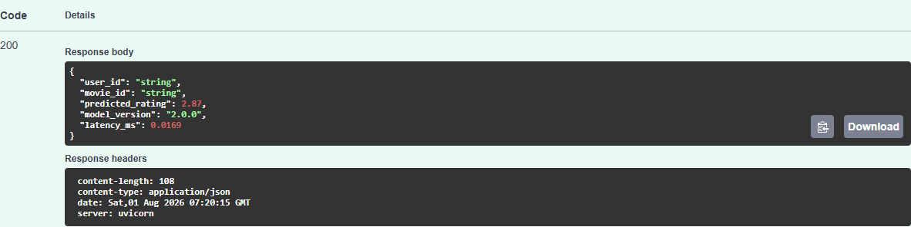
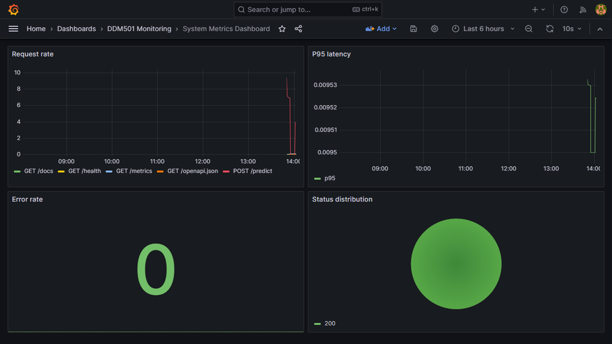
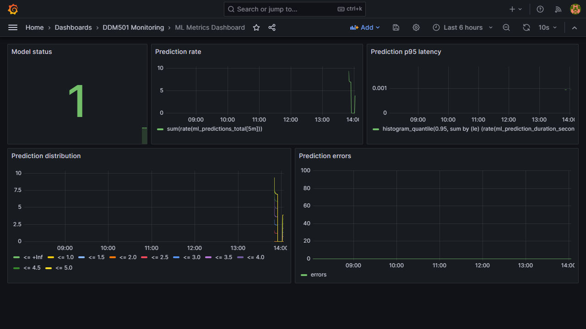

# Lab 4 - Monitoring & Production Deployment

The monitoring stack ships a metric-instrumented FastAPI application, Prometheus scraping and seven alert rules, plus two provisioned Grafana dashboards.

```powershell
docker compose up --build -d
python scripts/load_test.py --duration 30 --workers 10
```

- API: `http://localhost:8001/docs`
- Prometheus: `http://localhost:9090`
- Grafana: `http://localhost:3000` (`admin` / `admin`)

Grafana contains **System Metrics** (request rate, p95 latency, error rate and response status) and **ML Metrics** (model health, prediction rate/latency, value distribution and errors). Alert rules live in `prometheus/alerts/`.

## Verified monitoring evidence

The included load test generated 2,045 successful requests at roughly 256 req/s
with p95 latency of 24.8 ms. Prometheus reported the `movie-rating-api` scrape
target as `up`, and the two dashboards rendered with live data:






